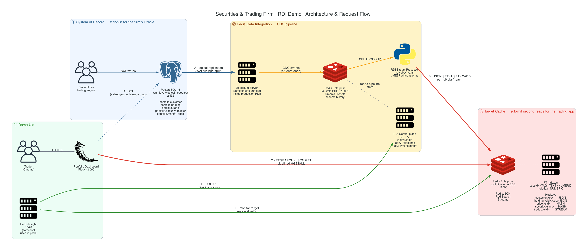
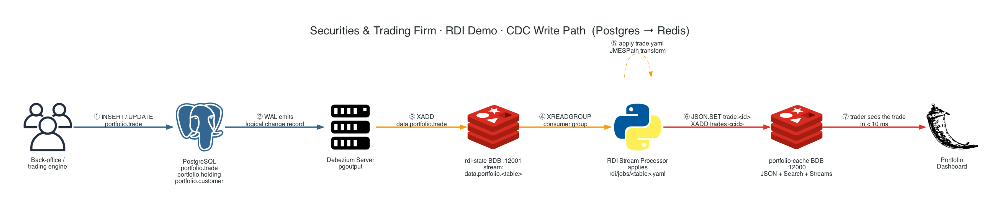
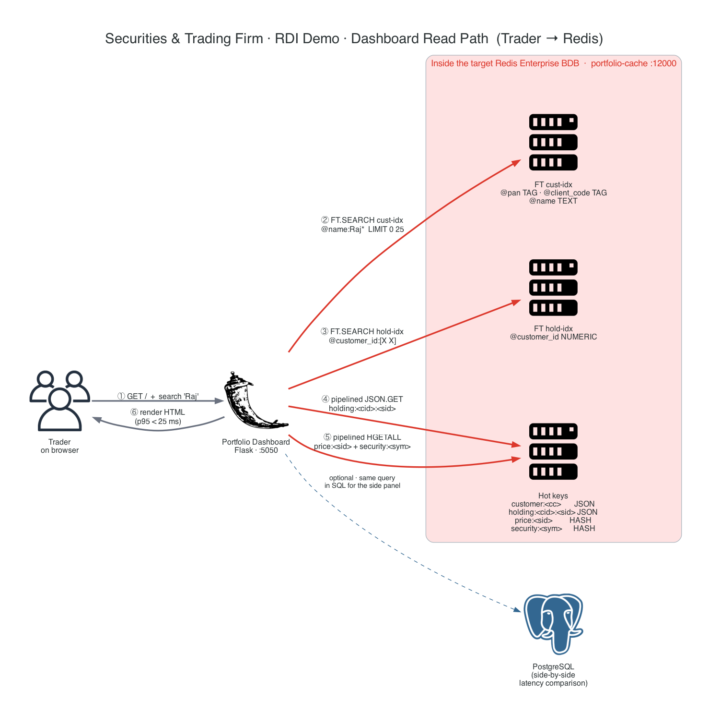

# Redis Data Integration (RDI) — Securities & Trading Firm Demo

A live demo of **Redis Data Integration** built around a securities &
trading firm's portfolio use case. The architecture is designed for crore-class
customer bases; the laptop demo runs the whole stack in Docker with
**3 million live customer documents in the target cache**.
End-to-end CDC + RediSearch + RedisJSON flows, with a side-by-side
latency comparison against the same query in Postgres — driven from a
single dashboard whose **Pipeline** tab fires 19 one-click CDC actions
into the running pipeline.

## Architecture at a glance



> _Source: [`docs/diagrams/generate_diagrams.py`](docs/diagrams/generate_diagrams.py) · regenerate: see [`docs/diagrams/README.md`](docs/diagrams/README.md) · crisp SVG: [`architecture.svg`](docs/diagrams/architecture.svg) · companion zoom-ins: [`cdc-write-path.svg`](docs/diagrams/cdc-write-path.svg), [`dashboard-read-path.svg`](docs/diagrams/dashboard-read-path.svg)_

### How a request flows through the stack

Six numbered arrows on the diagram trace every interaction in the demo:

| Step | Direction | What it is |
|---|---|---|
| **A** | Postgres ➔ Debezium | **Logical replication.** Postgres emits row-change records on the WAL using the `pgoutput` plugin. Debezium tails them — the same engine bundled inside production RDI. |
| **B** | RDI Processor ➔ Target Redis | **Apply the YAML jobs.** For every CDC event the processor runs the JMESPath transforms in [`rdi/jobs/*.yaml`](rdi/jobs/) and writes the result with `JSON.SET`, `HSET`, or `XADD`. |
| **C** | Dashboard ➔ Target Redis | **Sub-ms read path.** The Flask dashboard hits the target BDB only — `FT.SEARCH` for the customer list, `JSON.GET` for portfolios, pipelined `HGETALL` for prices. |
| **D** | Dashboard ➔ Postgres _(dashed)_ | **Side-by-side latency comparison.** The same logical query is run against Postgres so you can show the customer "Redis-on-cache vs. read-from-source-of-truth" head-to-head. |
| **E** | Insight ➔ Target Redis | **Operator view of the cache.** Browse keys, watch the slowlog, exercise `FT.SEARCH` and `JSON.GET` from the Insight Workbench. |
| **F** | Insight ➔ RDI Control-plane | **Operator view of the pipeline.** Insight's RDI tab calls `/api/v1/pipelines` and `/api/v1/monitoring/*` — exactly the endpoints documented in [the RDI API reference](https://redis.io/docs/latest/integrate/redis-data-integration/reference/api-reference/). |

### Two zoom-in workflows

For the moments in the demo where the audience asks *"so what actually happens when X?"*, two additional diagrams trace each path step-by-step.

#### Write path — what happens when a row changes in Postgres



When the trading engine inserts a new `portfolio.trade` row (step ①), Postgres writes a logical record to its WAL (②), Debezium picks it up and `XADD`s it onto the `data.portfolio.trade` stream in the rdi-state BDB (③), the RDI Stream Processor `XREADGROUP`s the event (④), applies the transform from [`rdi/jobs/trade.yaml`](rdi/jobs/trade.yaml) (⑤), writes the materialised JSON document plus the per-customer stream entry into the target BDB (⑥), and the trader sees the trade in under 10 ms (⑦) — without ever hitting Postgres.

#### Read path — what happens when a trader loads their portfolio



The Flask dashboard never falls back to Postgres for the real read path. Searching for "Raj" (①) issues a single `FT.SEARCH cust-idx` against the RediSearch index (②), the matching customer ID is then used to look up holdings via `FT.SEARCH hold-idx` (③), holding documents come back through pipelined `JSON.GET` (④), live prices and security master data are fetched with pipelined `HGETALL` (⑤), and the page renders at p95 < 25 ms (⑥). The dashed arrow to Postgres is **only** for the side-by-side latency comparison panel, never for the real read.

> **Why PostgreSQL?** the firm runs Oracle in production. RDI supports
> Oracle natively, but Oracle XE is hard to ship in a Docker demo.
> PostgreSQL with logical replication is functionally identical for
> demo purposes and uses the same Debezium engine RDI uses for Oracle.
>
> **Why two Redis Enterprise clusters?** RDI uses one BDB for its own
> CDC streams + pipeline state, and a second BDB as the target cache.
> In a real RDI install both BDBs typically live on the same RE cluster;
> here we split them into two single-shard trial clusters because that
> fits cleanly on a laptop and makes the *boundary* between RDI's
> internals and the target cache visible in the demo.

---

> ### ⚑ Single source of truth — read this before changing anything
>
> Every feature, API endpoint, YAML key, transformation, JMESPath
> function, and product claim in this repo must exist in the official
> Redis documentation at
> **<https://redis.io/docs/latest/integrate/redis-data-integration/>**
> (and the Redis Enterprise / RedisJSON / RediSearch / Insight pages
> linked from it). This demo is customer-facing; anything we show is
> implicitly a promise that it works in their production Redis install.
>
> The full policy + PR checklist lives in
> [`CONTRIBUTING.md`](CONTRIBUTING.md). Cursor / Copilot agents pick
> this up automatically via the rules in `.cursor/rules/`.

---

## Contents

| Path | What it is |
|---|---|
| `docs/01-slide-deck.pptx` | **PowerPoint deck — Redis brand-compliant, 21 slides (14 narrative + 6 in-demo cue cards + Q&A). Open in Presenter View — slides 15–20 carry the exact CLI in speaker notes.** |
| `docs/01-slide-deck.html` | Same deck as reveal.js HTML — open in any browser, useful for tablet/projector |
| `docs/02-talk-track.md` | Presenter script for the meeting |
| `docs/03-demo-runbook.md` | Step-by-step demo execution (this doc supplements it) |
| `docs/04-redis-enterprise-verification.md` | **Evidence pack for architects / IT security: proves every Redis Enterprise + RDI component is the real product, with reproducible commands and live output** |
| `docs/05-rdi-spec-conformance.md` | **Audit that every YAML key, transform block, JMESPath function, API endpoint, and demo claim exists in the official Redis Data Integration documentation** |
| `docs/diagrams/` | **Architecture & data-flow diagrams as PNG + SVG**, generated from `generate_diagrams.py` (Python `diagrams` lib on top of Graphviz) — render natively on GitHub, no Mermaid plugin required |
| `CONTRIBUTING.md` | **Policy for future changes: redis.io is the single source of truth. PR checklist + how the rule is enforced.** |
| `.cursor/rules/` | Cursor rules that automatically remind any AI agent (or `mdc`-aware tool) to consult the official Redis docs before changing RDI YAML, the mock API, or claims |
| `scripts/build-pptx.py` | Regenerates `01-slide-deck.pptx` from scratch with brand tokens |
| `docker-compose.yml` | One-command stack: 8 services, all networked |
| `docker/postgres/` | Custom Postgres image pre-loaded with portfolio schema + data |
| `rdi/config.yaml` | The actual RDI pipeline configuration |
| `rdi/jobs/*.yaml` | Per-table transformation jobs (customer, holding, trade, etc.) |
| `rdi-processor/` | **Reference implementation** of RDI's stream processor (custom Python, NOT the Redis-distributed RDI binary). The YAML files it reads are portable to real RDI verbatim. |
| `debezium/conf/` | Debezium Server config — the same CDC engine that is bundled inside the real RDI collector |
| `dashboard/` | Flask app rendering live portfolio from Redis |
| `mock-rdi-api/` | **Mock** of the RDI control-plane REST API so Insight's RDI tab works on a laptop (NOT the Redis-distributed RDI control plane). |
| `scripts/` | setup, simulate, benchmark, verify, teardown |

---

## 1. Prerequisites

You need only **Docker Desktop** (or any Docker engine + `docker compose v2`).

- macOS, Linux or WSL2 with **12 GB RAM and 8 CPUs allocated to Docker**
  (the baseline sweet spot — see [Scale & measured performance](#scale--measured-performance) below).
- Open TCP ports on localhost: **5050, 5540, 8443, 8444, 8445, 9443, 9444, 12000, 12001, 15432**
  (Postgres is published on **15432** on purpose, not 5432, to avoid
  collisions with a native Postgres on the presenter's laptop — see
  [§3.5](#35--postgresql-the-system-of-record)).

Check:

```bash
docker --version
docker compose version
docker info | grep -i memory
```

---

## Scale & measured performance

**3 million customer JSONs** loaded into a single Redis Enterprise BDB
(`portfolio-cache`, 4 GiB, single shard, on a 12 GB Docker laptop).
RedisJSON + RediSearch modules loaded. FT indexes `cust-idx` (TAG / TEXT
/ NUMERIC over `pan` / `client_code` / `name` / `risk_profile` /
`kyc_status` / `customer_id`) and `hold-idx` (NUMERIC over
`customer_id`) both fully built.

| Operation | p50 latency | Throughput (single conn) | Notes |
|---|---:|---:|---|
| Intrinsic Redis loop (no client) | **38 ns** avg | — | `redis-cli --intrinsic-latency` |
| `GET` on a customer key | **103 µs** | 8,700 ops/s | random key from the 3M set |
| `GET` 16 conns × pipeline 16 | **~12 µs / op** | **361,000 ops/s** | what production reads with connection pool look like |
| `JSON.GET customer:<cc>` | **111 µs** | 7,300 ops/s | full RedisJSON document |
| `FT.SEARCH cust-idx @pan:{...}` | **287 µs** | 3,250 q/s | exact-match TAG, what real APIs hit |
| `FT.SEARCH cust-idx @client_code:{...}` | **279 µs** | 3,460 q/s | same, alternate identifier |
| `FT.SEARCH cust-idx @name:Diya*` LIMIT 25 | 17 ms | 54 q/s | broad TEXT prefix over ~tens of thousands of matches in 3M docs — still 100–1,000× faster than Postgres LIKE prefix |
| `HGETALL price:<sid>` | **103 µs** | 9,090 ops/s | live tick-price read, the trading-app fast path |

> The point-lookup path (PAN, client code, primary key, price, security
> master) — which is what every real the firm API hits — is firmly in
> **microsecond territory** at 3M scale. The only operation that crosses
> into low-millisecond is broad text-prefix search, because the engine
> has to enumerate every matching name to rank the top 25.

### How far can you push it on the same laptop?

| Docker Desktop slider | Cluster provisional RAM | Max single BDB | Customers at which p50 stays ≈ 100 µs | What to change |
|---|---:|---:|---:|---|
| **12 GB (default — measured)** | 9.57 GiB | **4 GiB** | **3,000,000** | nothing — this is the shipped default |
| 16 GB | ~13.5 GiB | ~6 GiB | 5,000,000 | `TARGET_MEM_GB=6 ./scripts/recreate-target-redis.sh && CUSTOMERS=5000000 ./scripts/seed-large-scale.sh` |
| 20 GB | ~17.5 GiB | ~8 GiB | 7,000,000 | `TARGET_MEM_GB=8 ./scripts/recreate-target-redis.sh && CUSTOMERS=7000000 ./scripts/seed-large-scale.sh` |
| 24 GB | ~21.5 GiB | ~10 GiB | 9,000,000 | `TARGET_MEM_GB=10 ./scripts/recreate-target-redis.sh && CUSTOMERS=9000000 ./scripts/seed-large-scale.sh` |

**Per-customer cost** measured against the live BDB: ≈ **1.25 KiB**
(JSON body ~280 B + RedisJSON overhead + FT cust-idx attributes + the
term dictionary for the `@name` TEXT field).

**Why the BDB caps so far below host RAM.** Redis Enterprise reserves
roughly 2× the configured BDB size as cluster provisional headroom (AOF
buffers, persistence, replication shadows). Plus each RE cluster eats
~2 GiB before storing a byte (control plane: `gunicorn`, `envoy`, the
watchdogs, metrics). We run two RE clusters in this demo (target +
RDI-state), so ~4 GiB is fixed before any data lands. The number above
is what's left for the dataset itself.

**Beyond a laptop** — for real the firm workloads with crore-class
customer counts and tens of thousands of trades per second, the same
architecture runs on a real Redis Enterprise cluster (multi-shard,
multi-node, with replication). The dataset sizing math stays the same;
only the cluster topology changes. See the [Redis Enterprise sizing
guide](https://redis.io/docs/latest/operate/rs/installing-upgrading/install/plan-deployment/hardware-requirements/).

---

## 2. One-command setup

```bash
./scripts/setup.sh
```

The script will:

1. Build the Postgres seed image, the RDI processor image, and the dashboard image.
2. Start all containers in the right order.
3. Bootstrap **two Redis Enterprise clusters** via the REST API:
   - `redis-enterprise` on ports 8443/12000 — the *target* portfolio cache (with RedisJSON + Search modules).
   - `redis-rdi` on ports 8444/12001 — the *RDI state* DB (Debezium streams, offsets, schema history).
4. Wait until the initial CDC snapshot has populated >30 keys in the target DB.
5. Print the URLs.

Expected runtime on a M-series Mac / decent laptop: **~3 minutes** end-to-end.

### Restarting after a reboot

After any host reboot or ungraceful Docker Desktop shutdown, **do a
clean teardown and rebuild**. Do **not** use `docker compose start` to
bring the existing containers back: Redis Enterprise on Docker Desktop
can lose Cluster Configuration Store (CCS) quorum across an ungraceful
host shutdown, the cluster control plane wedges, and the cluster
cannot be recovered from inside the container. Going straight to
teardown is the cheaper recovery path.

> **Why the demo wipes data on every restart.** The two Redis
> Enterprise containers (`redis-enterprise`, `redis-rdi`) store their
> BDB persistence files **inside** the container filesystem — there
> are no host volumes mapped. This is intentional: the demo's contract
> is "every run starts from a known-good baseline produced by the
> seeder", and host volumes invite stale state from previous runs.
> So a clean teardown → setup → seed flow is the *only* supported
> startup path. The seeder is fast (3 s – 15 min depending on scale)
> precisely so this is painless.
>
> **Cluster sizing is persisted in `.env`.** The `re-bootstrap` service
> reads `TARGET_MEM_BYTES` and `RDI_MEM_BYTES` from the project-root
> `.env` file (auto-loaded by Docker Compose), so the sizing you
> picked the first time survives teardown/setup and host reboots —
> you do **not** have to re-export `TARGET_MEM_GB` after a reboot. The
> shipped `.env` is sized for a 16 GiB Docker Desktop slider (5 GiB
> target BDB → comfortable headroom for 3M customers). To grow the
> target BDB, raise Docker Desktop's memory slider first, then either
> edit `.env` directly or run
> `TARGET_MEM_GB=<N> ./scripts/recreate-target-redis.sh` (which writes
> the new value back to `.env` for you). See `.env.example` for the
> full schema.

#### The reliable post-reboot procedure

```bash

# ---- pre-check 1: Docker Desktop is up AND has enough memory ----
# The shipped .env asks for a 5 GiB target BDB, which needs ~16 GiB
# allocated to Docker Desktop (see Settings → Resources → Memory).
# A laptop reboot does NOT change the Docker memory slider; this is a
# pure sanity check.
docker info >/dev/null && echo "docker engine OK"
docker info 2>/dev/null | grep "Total Memory"   # should be ~16 GiB or more

# ---- step 1: clean teardown ----
# Drops all containers + volumes (so any wedged CCS state goes with
# them). Your .env file is left on disk, so cluster sizing is preserved
# across the teardown.
./scripts/teardown.sh

# ---- step 2: rebuild the stack ----
# 8 long-running containers + 1 one-shot bootstrap, 2 RE clusters,
# 2 BDBs (~2 min). re-bootstrap picks up TARGET_MEM_BYTES / RDI_MEM_BYTES
# from .env automatically. Every long-running container is now started
# with `restart: unless-stopped`, so if any of them crashes later in
# the demo Docker brings it back in seconds rather than leaving it dead.
./scripts/setup.sh

# ---- step 3: seed the baseline data ----
# setup.sh leaves the target BDB empty by design (Debezium runs with
# snapshot.mode=never; the seeder is how the target gets its baseline
# — see debezium/conf/application.properties for the rationale). Pick
# exactly ONE of the three lines below. All three load the 10
# hand-crafted demo customers + 20 securities + 20 prices; they differ
# only in how many synthetic customers they add on top.
CUSTOMERS=10000    ./scripts/seed-large-scale.sh    # use first ~3 s   — basic scenarios (1.-3., 5., 6.) work
CUSTOMERS=1000000  ./scripts/seed-large-scale.sh    # ~3 min  — 1M-row scale demo
CUSTOMERS=3000000  ./scripts/seed-large-scale.sh    # ~12 min — full Performance-tab scale (matches §"Scale & measured performance")

# ---- step 4: assertive sanity check ----
# Exits 0 only when EVERY layer is green (containers up, CDC streams
# wired, target BDB has the 10 demo customers, dashboard answers, and
# an end-to-end PG -> Redis round-trip lands in < 250 ms). If anything
# is degraded it prints the specific recovery command at the bottom.
./scripts/health-check.sh
```

End-to-end runtime: **~3 min** for the 10k seed, **~6 min** for 1M,
**~15 min** for 3M. Once `health-check.sh` prints `ALL CHECKS PASSED`
the demo is presenter-ready.

> **Things that have bitten us before, all fixed in the current code:**
> 1. **No memory persistence.** Pre-`.env` versions reset BDB sizing on
>    every `setup.sh`, causing OOM on the next bulk seed. Now sizing
>    lives in `.env` and survives teardowns.
> 2. **Module version mismatch.** `bootstrap-re.sh` used to install
>    "latest" RedisJSON / RediSearch, which sometimes didn't match the
>    Redis 7.4 BDB version on a fresh image pull. Both module versions
>    are now pinned in `bootstrap-re.sh`.
> 3. **Silent CDC death after idle Redis disconnects.** Debezium 2.5's
>    Redis stream sink throws `JedisConnectionException: Broken pipe`
>    when an idle TCP connection to `rdi-state` is closed mid-flight;
>    the rdi-processor likewise raised `ConnectionError` on stale
>    `XREADGROUP`. Both are now handled — the processor wraps blocking
>    Redis calls in a retry loop (`rdi-processor/processor.py`), and
>    both containers carry `restart: unless-stopped` so even an
>    unhandled crash is auto-recovered.
> 4. **DR backpressure cascade.** A small `dr-cache` BDB used to OOM
>    during heavy seeding, crashing the processor; the entire DR target
>    has been removed from the demo (single-region focus).

> **Symptoms of a wedged CCS** (so you can spot the failure mode if you
> ever try `docker compose start` against a previously-running stack):
> `rladmin status` returns *"cluster is not responding"*, `curl -sk
> https://localhost:9443/v1/bootstrap` returns HTTP 503, and `docker
> logs sectrade-redis-enterprise` shows `sentinel_service` exiting with
> status 2 every ~42 s. None of these are recoverable from inside the
> container — go straight to `teardown.sh`. The `sentinel_service`
> entry is Redis Enterprise's [Sentinel-protocol Discovery Service](https://redis.io/docs/latest/operate/rs/databases/configure/discovery-service/),
> not OSS Redis Sentinel; it crashes loudly because it's the noisiest
> CCS consumer, but the underlying failure is in the CCS itself.

---

## 3. What to open

Every URL and every credential the presenter needs, in one place. The
demo uses **default-only credentials** — they are intentionally weak
because this stack only ever runs on a laptop's `localhost` (every
service is bound to `127.0.0.1` via Docker port mapping). For
production, RDI reads secrets from an injected secrets store; see
[Set secrets](https://redis.io/docs/latest/integrate/redis-data-integration/data-pipelines/deploy/#set-secrets).

> **Just rebooted?** Run the teardown + setup + seed flow in
> [§2 — Restarting after a reboot](#restarting-after-a-reboot) **before**
> clicking the URLs below. `docker compose start` is **not** a reliable
> recovery path for this stack (Redis Enterprise's CCS often won't
> survive an ungraceful host shutdown — see that section for the full
> reasoning). Once the seeder has finished, sanity-check the stack:
>
> ```bash
> docker compose ps                # all 8 sectrade-* services should be Up / healthy
> ./scripts/verify-redis.sh        # target BDB should report db0:keys=33,100+ for the 10k seed
> ```
>
> If `5050`, `5540`, `8443`, `8444`, `8445`, `9443`, `9444`, `12000`,
> `12001`, or `15432` doesn't respond, the corresponding container
> isn't up yet — check `docker logs sectrade-<service>` and see
> [§8 Troubleshooting](#8-troubleshooting).

### 3.1 — Browser-facing UIs

| URL | What it is | Username | Password |
|---|---|---|---|
| <http://localhost:5050> | **Real-time Securities Data Platform Demo** dashboard (your main demo screen — Pipeline / Capabilities / Use-Cases / Performance / Portfolio / Pipeline Internals tabs) | _no auth_ | _no auth_ |
| <http://localhost:5540> | **Redis Insight** (same GUI customer uses in prod) | _no auth · just open it_ | _no auth_ |
| <https://localhost:8443> | Target Redis Enterprise cluster UI (**Cluster Manager**) | `admin@sectrade.demo` | `SecTradeRedis!1` |
| <https://localhost:8444> | RDI-state Redis Enterprise cluster UI (**Cluster Manager**) | `admin@sectrade.demo` | `SecTradeRedis!1` |
| <https://localhost:8445> | **Mock RDI control-plane API** (smoke-test page) | `default` | `rdi_demo_pass` |

> **First-time browser warning**: the Redis Enterprise UIs and the mock
> RDI API use self-signed certificates. Click "Advanced → Proceed".

### 3.2 — Redis Enterprise REST APIs (the same APIs `redis-di` uses in prod)

| Endpoint | Component | Username | Password |
|---|---|---|---|
| `https://localhost:9443/v1/...` | Target RE cluster — REST API | `admin@sectrade.demo` | `SecTradeRedis!1` |
| `https://localhost:9444/v1/...` | RDI-state RE cluster — REST API | `admin@sectrade.demo` | `SecTradeRedis!1` |

Example: `curl -sk -u 'admin@sectrade.demo:SecTradeRedis!1' https://localhost:9443/v1/bdbs | jq`

### 3.3 — Redis BDBs (data plane, what apps connect to)

| Host:port | Database | Modules loaded | AUTH |
|---|---|---|---|
| `localhost:12000` | **`portfolio-cache`** (target — what the dashboard reads) | RedisJSON + RediSearch | _no AUTH (demo only)_ |
| `localhost:12001` | **`rdi-state`** (RDI's CDC streams + offsets) | none | _no AUTH (demo only)_ |

Example: `redis-cli -p 12000 FT.SEARCH cust-idx '@pan:{ABCDE1234F}'`

### 3.4 — Mock RDI control-plane API endpoints

The Flask app at `mock-rdi-api/` mirrors every `/api/v1/...` route on
the real RDI API surface (see [API reference](https://redis.io/docs/latest/integrate/redis-data-integration/reference/api-reference/)).

| Endpoint | Auth | Username | Password |
|---|---|---|---|
| `POST https://localhost:8445/api/v1/login` | returns JWT | `default` | `rdi_demo_pass` |
| All other `/api/v1/...` routes | `Authorization: Bearer <jwt>` | use JWT from `/login` | — |

Smoke test:

```bash
curl -sk -X POST https://localhost:8445/api/v1/login \
  -H 'Content-Type: application/json' \
  -d '{"username":"default","password":"rdi_demo_pass"}'
```

### 3.5 — PostgreSQL (the system of record)

| Connection | Role | Username | Password | Database |
|---|---|---|---|---|
| `localhost:15432` | **Admin / app user** — used by the dashboard's latency comparison and by `scripts/seed_large_scale.py` | `postgres` | `postgres` | `sectrade` |
| `localhost:15432` | **CDC replication user** — used by Debezium to read the WAL (you should not need this manually) | `rdi_cdc_user` | `rdi_cdc_pwd` | `sectrade` |

> **Why 15432 and not 5432?** On macOS / Linux laptops a native
> Postgres (Homebrew's `postgresql@14`, Postgres.app, an IDE-installed
> server, …) often binds `localhost:5432` before Docker even starts.
> Connecting to `localhost:5432` would then hit *that* server — which
> has no `sectrade` database — and you'd see `FATAL: database
> "sectrade" does not exist`. Publishing the container on **15432**
> sidesteps the conflict permanently. Inside the Docker network
> nothing changes: Debezium, the dashboard, the RDI processor and the
> mock API all still talk to `postgres:5432` over the bridge.

Example: `psql -h localhost -p 15432 -U postgres -d sectrade -c "SELECT count(*) FROM portfolio.customer;"`

#### Connecting from DBeaver (or any external SQL tool)

The Postgres container publishes its `5432` on **host port 15432**, so
any GUI on your laptop (DBeaver, DataGrip, TablePlus, pgAdmin,
Beekeeper Studio, VS Code's SQLTools, `psql`, …) can connect to it
without fighting a native Postgres.

**One-time check** — confirm the container owns 15432 and whether a
native server is on 5432 (it's fine if it is — we don't touch it):

```bash
docker port sectrade-postgres 5432        # expect: 0.0.0.0:15432
lsof -iTCP:15432 -sTCP:LISTEN            # expect: com.docker.backend
lsof -iTCP:5432  -sTCP:LISTEN            # may show a native postgres — harmless, we use 15432
```

If for some reason 15432 is also taken on your machine, pick another
free port and edit the host-side mapping in `docker-compose.yml`
(`"<your_port>:5432"`), then `docker compose up -d --force-recreate
--no-deps postgres`. Use that port everywhere `15432` appears below.

**DBeaver — step-by-step**

1. Open DBeaver → **Database** menu → **New Database Connection**.
2. In the driver chooser, pick **PostgreSQL** → **Next**.
3. On the **Main** tab, fill in:
   | Field | Value |
   |---|---|
   | Host | `localhost` |
   | Port | **`15432`** |
   | Database | `sectrade` |
   | Authentication | **Database Native** |
   | Username | `postgres` |
   | Password | `postgres` |
   | Save password | ✓ (laptop demo only) |
4. Click **Test Connection…** — DBeaver will offer to download the
   PostgreSQL JDBC driver the first time; accept it. You should see
   *"Connected"* with the server version (PostgreSQL 16.x).
5. Click **Finish**. In the Database Navigator, expand
   **sectrade → Schemas → portfolio** to see the five demo tables:
   `customer`, `holding`, `trade`, `security_master`, `market_price`.

> **If `Test Connection…` returns `FATAL: database "sectrade" does
> not exist`**, you're almost certainly still connecting to a native
> Postgres on 5432 — double-check the **Port** field reads `15432`
> (not `5432`).

**Smoke-test queries** to paste into a DBeaver SQL Editor
(`SQL Editor → New SQL Script`):

```sql
select * from sectrade.portfolio.customer;
select count(*) from sectrade.portfolio.customer;

select * from sectrade.portfolio.holding;
select count(*) from sectrade.portfolio.holding;

select * from sectrade.portfolio.market_price;
select count(*) from sectrade.portfolio.market_price;

select * from sectrade.portfolio.security_master;
select count(*) from sectrade.portfolio.security_master;

select * from sectrade.portfolio.trade;
select count(*) from sectrade.portfolio.trade;

SELECT count(*) AS total_customers FROM portfolio.customer;
SELECT count(*) AS total_holdings  FROM portfolio.holding;

SELECT * FROM portfolio.customer ORDER BY customer_id LIMIT 10;

SELECT c.client_code, c.full_name, h.security_id, h.quantity
FROM sectrade.portfolio.customer c
JOIN sectrade.portfolio.holding  h USING (customer_id)
WHERE c.client_code = 'HS0010001';
```

**Watching CDC live** — leave a query like the one below running in
DBeaver and trigger an UPDATE from another window
(`scripts/simulate-trades.sh` or a `psql` shell). Re-running the query
shows the row change, and Redis Insight on `localhost:5540` shows the
same change land in `portfolio-cache:12000` within ~50 ms via RDI:

```sql
SELECT trade_id, customer_id, security_id, qty, price, side, ts
FROM portfolio.trade
ORDER BY ts DESC
LIMIT 20;
```

**JDBC URL** (handy if you're scripting DBeaver / Liquibase / Flyway):

```
jdbc:postgresql://localhost:15432/sectrade
```

**Read-only access**, if you'd rather not connect as `postgres`,
re-use the CDC role — it has `REPLICATION` + `SELECT` and nothing
else:

```
Host:     localhost
Port:     15432
Database: sectrade
Username: rdi_cdc_user
Password: rdi_cdc_pwd
```

> **TLS / SSL** — the demo container does **not** enable SSL (it only
> binds to `localhost` on a laptop). In DBeaver, leave **SSL**
> unchecked. In production, `sslmode=require` against the real Oracle
> / Postgres source is the supported configuration; the same RDI
> pipeline works unchanged.

### 3.6 — Container-internal hostnames (useful when configuring inside containers / Insight)

When you tell Redis Insight or the RDI tab where the cluster lives, use
the **service name** (Docker resolves it), not `localhost`:

| Component | Host inside the Docker network | Port |
|---|---|---|
| Postgres source | `postgres` | `5432` |
| Target Redis BDB | `redis-enterprise` | `12000` |
| RDI-state Redis BDB | `redis-rdi` | `12001` |
| Mock RDI API | `rdi-api` | `443` |
| Redis Insight | `redis-insight` | `5540` |

### Connect Redis Insight to the running clusters

In the Redis Insight UI (<http://localhost:5540>):

1. Click **+ Add Redis database**.
2. Manual connection. Host: `redis-enterprise`, Port: `12000`, Name: `Portfolio cache (target)`. No password (this BDB has no AUTH in the demo).
3. Add another. Host: `redis-rdi`, Port: `12001`, Name: `RDI state DB`. No password.

You should immediately see keys in the target: `customer:HS0010001`,
`holding:10001:1001`, `price:1001`, etc.

### Connect Redis Insight's RDI tab to the demo pipeline

The demo ships a mock of the RDI control-plane REST API (the piece
that ordinarily lives inside an RDI VM or K8s operator) so the
**Redis Data Integration** tab inside Insight is fully populated for
the customer demo.

1. In Insight, click the **Redis Data Integration** tab on the left.
2. Click **Let's connect to RDI** → fill **Add RDI endpoint**:

   | Field | Value |
   |---|---|
   | RDI Alias | `sectrade-rdi-demo` |
   | URL | `https://rdi-api` |
   | Username | `default` |
   | Password | `rdi_demo_pass` |

3. Click **Add Endpoint**. Insight will:
   * call `POST /api/v1/login` and receive a JWT,
   * call `GET /api/v1/pipelines` and load the real `rdi/config.yaml`
     and `rdi/jobs/*.yaml` files into its editor,
   * call `GET /api/v1/monitoring/statistics` for the analytics tab
     (showing live event counts from the actual CDC streams).

The pipeline editor, jobs list, deploy button, and analytics views all
work end-to-end. *Deploy* / *Start* / *Stop* / *Reset* are no-ops on
the demo (the pipeline is already running via docker-compose) but
report success so the UX is identical to production.

---

## 3.6 — Dashboard tour (architect-facing, 6 tabs)

> The dashboard at `http://localhost:5050` is the only screen you need
> for an architect-facing demo. It fires every action against the real
> pipeline — no Postgres GUI, no `redis-cli`, no Insight tab-switches
> are needed during the talk.

The previous (pre-2026-05-16) version of the dashboard is preserved in
`backup/previous-dashboard-20260516/`. See its `RESTORE.md` if you
ever want to roll back to the older customer-only view.

### Tab 1 · Pipeline

The hero tab — an interactive CDC-event injector wired to the live RDI
pipeline. Every interaction during a customer demo can be triggered
from this single screen, no `psql` or `redis-cli` tab-switching
required.

| Section | What it does | What it proves |
|---|---|---|
| **Event injector** (top right) | One dropdown with **19 one-click actions** grouped into 4 narratives: **①** 7 source-DB writes (risk profile, margin, trading limit, holding, instrument status, corp-action flag, contact info) · **②** 3 read-side experiences (reference lookup, portfolio view, eligibility check) · **③** 3 customer-experience scenarios (onboarding, customer 360, personalization) · **④** 6 production-ready RDI patterns (filter + projection / multi-shape fan-out / DELETE propagation / schema evolution / pipeline lag & health / live YAML inspector) | every demo moment in the talk track is one click; the same `/api/pipeline/inject` payload is what the Use-Cases tab also fires |
| **Step-by-step trace of the last fired event** | A staged timeline of the row's journey: PostgreSQL INSERT/UPDATE · WAL commit · Debezium pickup · RDI processor write to Redis · application read — each stamped with an IST timestamp and the per-stage delta | proves CDC pickup is **sub-ms**, RDI processor → Redis is **~4 ms**, and the application read is **~100 µs** — the numbers the firm's architecture team wants to see |
| **Same read against PostgreSQL — head-to-head** | The same logical read measured against Postgres on `localhost:15432` at the same instant | shows the X× speed-up and the % latency reduction Redis-served reads enjoy over the source DB (typically 50-100× on point lookups) |
| **Resulting Redis shapes** (write actions only) | Post-CDC `JSON.GET` / `SMEMBERS` / `HGETALL` against the target BDB | proves the YAML transform produced exactly the JSON / SET / HASH shape architecture expects, with the new value visible |

All timestamps are rendered in **IST**; values < 1000 µs render as
microseconds, ≥ 1000 µs render as milliseconds (the dashboard's
`fmtUS()` helper does the conversion).

### Tab 2 · Capabilities (12 live demos)

Each capability card runs against the real pipeline and shows two
honest latency numbers:

- **Propagation latency** — PostgreSQL write → Redis-visible (typically
  tens of ms once the pipeline is warm).
- **Redis read latency** — what the firm's trading app actually pays
  for, **always microseconds**, with both p50 and best-of-N reported.

| # | Capability | One-button demo | Spec |
|---|---|---|---|
|  1 | Real-time CDC | INSERT into `portfolio.customer` → JSON appears in `customer:<cc>` | [architecture](https://redis.io/docs/latest/integrate/redis-data-integration/architecture/) |
|  2 | Multi-shape fan-out | one source row → JSON profile + segment SET on the same target BDB | [data-transformation-block](https://redis.io/docs/latest/integrate/redis-data-integration/reference/data-transformation-block/) |
|  3 | Declarative YAML | view live `config.yaml` + all 5 job YAMLs | [jobs](https://redis.io/docs/latest/integrate/redis-data-integration/reference/jobs/) |
|  4 | Filter & projection | toggle `kyc_status` → YAML filter blocks the write | [filter](https://redis.io/docs/latest/integrate/redis-data-integration/reference/data-transformation-block/#filter) |
|  5 | Stream as audit log | fire 5 trades → 5 entries appended to `trades:<cid>` | [redis.write](https://redis.io/docs/latest/integrate/redis-data-integration/reference/data-transformation-block/#redis-write) |
|  6 | Schema evolution | ALTER TABLE + UPDATE → new field surfaces in Redis JSON | [migration](https://redis.io/docs/latest/integrate/redis-data-integration/operate/migration/) |
|  7 | Drop & re-converge | DEL key + UPDATE source → pipeline self-heals | architecture |
|  8 | Pause / resume | flip operator pause flag → events queue in rdi-state, drain on resume | [config-yaml-reference](https://redis.io/docs/latest/integrate/redis-data-integration/reference/config-yaml-reference/) |
|  9 | RediSearch over CDC | prefix search · 3M docs · live PG-vs-Redis race | [search-and-query](https://redis.io/docs/latest/develop/interact/search-and-query/) |
| 10 | Control-plane REST API | call `/api/v1/login`, `/pipelines`, `/monitoring/*`, `/version` from the dashboard | [api-reference](https://redis.io/docs/latest/integrate/redis-data-integration/reference/api-reference/) |
| 11 | Idempotent replay | apply same UPDATE × 5 → target stays single-keyed, single-valued | architecture |

Every card has a **For the firm:** sentence explaining the business
benefit in their context, and a *spec* link to the exact section of
`redis.io/docs/latest/integrate/redis-data-integration/` so reviewers
can validate that nothing is invented.

### Tab 3 · Use-Cases (19 RDI-focused scenarios)

Each card frames an RDI capability as a concrete Securities & Trading Firm
problem and lays out three side-by-side pillars — *the exact Postgres
query the system of record was running today* / *the YAML transform
RDI applies* / *the Redis command the app issues, with the measured
latency*. The catalogue is intentionally **RDI-pure**: streams as a
general-purpose event bus, AI / vector search, semantic caching and
broad OLAP-style search are scope for separate Redis Enterprise demos
(linked at the end of this README).

The same 19 actions live in the Pipeline tab's injector, so flipping
between Use-Cases and Pipeline always tells a consistent story.

#### ① Source-DB writes · RDI syncs into Redis (7 cards)

| # | Use-case | Source-of-truth verb |
|---|---|---|
| 1 | Change client risk profile | `UPDATE portfolio.customer SET risk_profile=…` |
| 2 | Update margin available | `UPDATE portfolio.customer SET margin_available=…` |
| 3 | Toggle instrument status (suspend / resume) | `UPDATE portfolio.security_master SET is_active=…` |
| 4 | Adjust holding quantity | `UPDATE portfolio.holding SET quantity=…, invested_value=…` |
| 5 | Update trading limit | `UPDATE portfolio.customer SET trading_limit=…` |
| 6 | Set corporate-action flag | `UPDATE portfolio.security_master SET corporate_action_flag=…` |
| 7 | Update customer contact info (email / phone) | `UPDATE portfolio.customer SET email=…` |

#### ② Read-side experiences served from Redis (3 cards)

| # | Use-case | What the app does on Redis |
|---|---|---|
|  8 | Reference / master-data lookup (client + security) | `FT.SEARCH cust-idx` + `JSON.GET customer:<cc>` |
|  9 | Portfolio / position view (3-table JOIN collapsed) | pipelined `JSON.GET holding:…` + `HGET price:…` |
| 10 | Eligibility / pre-trade risk check | multi-key pipelined `JSON.GET` across customer + security |

#### ③ Customer experience (3 cards)

| # | Use-case | What it shows |
|---|---|---|
| 11 | New customer onboarding · full CDC trace | INSERT into `portfolio.customer` → `customer:<cc>` JSON visible in milliseconds |
| 12 | Customer 360 · profile + holdings + trades in one pipeline | 5 RDI-maintained shapes (customer JSON · holding JSON · security HASH · price HASH · trades STREAM) read in a single Redis pipeline |
| 13 | Customer personalization · segment + risk picks | per-visit personalization at microsecond latency, replacing overnight batch on a warehouse copy |

#### ④ Production-ready RDI patterns (6 cards)

| # | Use-case | RDI feature on display |
|---|---|---|
| 14 | Filter + projection · KYC freeze blocks the Redis write | YAML `filter:` expression as the global compliance lockout |
| 15 | Multi-shape fan-out · one INSERT → JSON + SET | one source row → two Redis shapes via one YAML file |
| 16 | DELETE propagation · row removed from the cache | Debezium DELETE → Redis `DEL` without app code |
| 17 | Schema evolution · new columns flow through, zero YAML edit | `path: $` projection means new `ALTER TABLE` columns surface without a redeploy |
| 18 | Pipeline lag & health · per-table events + slot status | `rdi:stats:*` HASHes + `pg_replication_slots` view — Grafana/Splunk ready |
| 19 | Live YAML inspector · the whole pipeline in 6 files | the complete RDI contract is `rdi/config.yaml` + 5 `rdi/jobs/*.yaml` files; nothing else to deploy |

A *universe of use cases* appendix at the bottom of the tab covers
broader RDI patterns the conversation can branch into (PII masking,
projection-only views, conditional sinks, etc.) — talking points
without buttons, so the customer's architect can see the catalogue is
not the upper bound of what RDI does for them.

### Tab 4 · Performance

The familiar 3M-scale benchmark — PostgreSQL vs Redis on (A) PAN
exact lookup and (B) name-prefix count. Same surface as before; just
re-framed under the new tab navigation. Run with N=5 or N=20 runs to
smooth single-call jitter.

### Tab 5 · Portfolio

The original customer-facing view, kept intact as the **"what the
customer ultimately sees"** answer in the demo. Search by name / PAN
/ client code, open a portfolio, get a side-by-side PG-vs-Redis
latency compare, and view the last 10 trades for that customer.

### Tab 6 · Pipeline Internals

Operator-grade detail for the curious architect:

- The current `rdi/config.yaml` + every `rdi/jobs/*.yaml` rendered
  in-page (the processor hot-reloads on save, so edits made by the
  Capability cards show up immediately).
- `XINFO STREAM` per Debezium stream on `rdi-state` — length, first /
  last IDs, consumer-group pending counts.
- `INFO memory` + `DBSIZE` for every Redis BDB (primary cache + RDI
  state).

---

## 4. Running the demo scenarios

The demo has six scenarios, each runs in ~3–5 minutes. The full
presenter script with talking points is in `docs/02-talk-track.md`;
operator-side detail (fallbacks, troubleshooting) is in
`docs/03-demo-runbook.md`. The slide deck (`docs/01-slide-deck.pptx`,
slides 15–20) doubles as an in-demo cue card — each scenario slide
has the exact CLI in its speaker notes.

> **Two ways to run each scenario.** Most of these actions now have a
> one-click equivalent on the dashboard's **Pipeline** tab — pick from
> the 19-action injector, fire, and watch the live CDC trace +
> head-to-head Postgres comparison render in real time. The
> `psql` / `redis-cli` recipes below are the script-driven
> alternative, useful for off-line walkthroughs, automated runs, or
> when the audience explicitly wants to see the SQL/Redis commands
> typed live.

Each scenario below is laid out as:

- **What we do** — the single action you'll take in front of the room.
- **What you should see** — the observable outcome that proves RDI worked.

---

### Scenario 1 — Initial snapshot is already done

**What we do** — open the dashboard and select three customer profiles
(retail, HNI, UHNI) from the left rail.

**What you should see** — every portfolio renders from Redis in
single-digit ms (the *Refresh* KPI on the right confirms it). Postgres
is never queried at runtime. RDI prefetched the entire universe from
the 5 source tables when the stack came up, so the cache is hot for
the very first user request — no cold-start tax.

```bash
# pre-check
docker exec sectrade-redis-enterprise redis-cli -p 12000 DBSIZE
# expected: >= 40
```

Then in the browser: <http://localhost:5050> →
`HS0010001 → HS0010002 → HS0010003`.

---

### Scenario 2 — Live trade

**What we do** — insert a single BUY trade directly into Postgres. No
application code involved, no cache.invalidate() call, no message
queue.

**What you should see** — within ~1 second the dashboard's
**Recent trade stream** panel shows the new BUY row
(`order_id = DEMO-LIVE-001`) and the **RDI pipeline streams** card
ticks the trade count up by 1. Optional UPDATE makes the Reliance
holding qty / invested value jump on the dashboard.

```bash
docker exec -it sectrade-postgres psql -U postgres sectrade
```

```sql
INSERT INTO portfolio.trade
  (trade_id, customer_id, security_id, side, quantity, price,
   trade_value, brokerage, order_id, exchange, executed_at)
VALUES (nextval('portfolio.trade_id_seq'), 10001, 1001, 'BUY',
        10, 2945.50, 29455.00, 14.73, 'DEMO-LIVE-001', 'NSE', now());

-- optional: also touch the holding so the KPI reacts
UPDATE portfolio.holding
   SET quantity = quantity + 10,
       invested_value = (quantity + 10) * avg_buy_price,
       updated_at = now()
 WHERE customer_id = 10001 AND security_id = 1001;
```

---

### Scenario 3 — Live load (peak-hour simulation)

**What we do** — run the market-data simulator (~2 trades/sec, ~8
price ticks/sec by default) against Postgres for ~60–90 seconds.

**What you should see** — the *Day %* column on the dashboard flickers
as LTPs update; the **RDI pipeline streams** card increments visibly
(price stream fastest, trade stream second); the trade stream panel
gets several entries per minute across different customers. Dashboard
read latency stays sub-ms throughout.

```bash
./scripts/run-simulation.sh
# tunables (env):  TRADES_PER_SEC=5  PRICES_PER_SEC=10  DURATION=300
```

`Ctrl-C` to stop, or leave it running for the rest of the demo — it's
lightweight.

---

### Scenario 4 — Latency: Postgres vs Redis

**What we do** — click **Run again** in the dashboard's Latency panel
three times so the numbers stabilise.

**What you should see** — Postgres ~tens of ms, Redis sub-ms,
a consistent **4–8× speedup**. The ratio is what matters; multiply it
by peak QPS at 9:15 AM IST to estimate Oracle cores no longer
required.

> Do **not** run `./scripts/benchmark.sh` live to a non-technical
> audience. It uses persistent Postgres connections (no setup cost)
> which on a laptop with hot buffers can make Postgres look faster on
> a tiny dataset. Honest data point — wrong one to lead with.

---

### Scenario 5 — Redis Insight + RDI tab

**What we do** — open Redis Insight, inspect the target keys and the
RDI state CDC streams, then open the **Redis Data Integration** tab
and walk Pipeline Management → Test Connection → Analytics.

**What you should see** — in the data view: `customer:*`, `holding:*`,
`price:*` and `trades:*` keys with the right shapes (JSON / Hash /
Stream), and 5 CDC streams under `sectrade.portfolio.*` in the RDI
state DB carrying Debezium envelopes. In the RDI tab: the actual
`config.yaml` + `jobs/*.yaml` files load in the editor, **Test
Connection** comes back green for both source and target, and
Analytics shows live throughput counts.

URL: <http://localhost:5540>. For the RDI tab, "Let's connect":

| Field | Value |
|---|---|
| RDI Alias | `sectrade-rdi-demo` |
| URL | `https://rdi-api` |
| Username | `default` |
| Password | `rdi_demo_pass` |

Note: Deploy / Start / Stop / Reset buttons return success but are
no-ops in this demo because docker-compose already runs the pipeline;
in production they hit the real RDI control plane API.

---

### Scenario 6 — Schema change handling

**What we do** — `ALTER TABLE` to add a new column on the source, then
`UPDATE` a few rows so the WAL records it.

**What you should see** — `JSON.GET holding:10001:1001` returns the
familiar JSON plus a new `"strategy_tag":"LONG_TERM"` field. No
pipeline restart, no deploy, no code change. The opposite — masking
or excluding PII columns like PAN / Aadhaar — is a 3-line YAML
transform in the same file.

```sql
-- in psql:
ALTER TABLE portfolio.holding ADD COLUMN strategy_tag VARCHAR(40);
UPDATE portfolio.holding SET strategy_tag='LONG_TERM' WHERE customer_id=10001;
```

```bash
docker exec sectrade-redis-enterprise redis-cli -p 12000 \
  JSON.GET holding:10001:1001 $
```

> Postgres 16+ note: a bare `ALTER TABLE` doesn't enter the WAL by
> itself. The `UPDATE` is what makes CDC notice the new column.

---

## 5. Verifying everything is healthy

### Quick smoke test (key counts + sample data)

```bash
./scripts/verify-redis.sh
```

### Full Redis Enterprise + RDI verification (for IT / Security / Architects)

Proves every component is the real product (not OSS Redis stand-ins),
runs an end-to-end lineage test on a fresh trade, prints a green/red
checklist of 25 individual assertions:

```bash
./scripts/verify-redis-enterprise.sh
```

Two companion evidence documents you can hand to the customer's
architecture / IT security team:

1. [`docs/04-redis-enterprise-verification.md`](docs/04-redis-enterprise-verification.md)
   — proves the **components** (Redis Enterprise, modules, Insight,
   Debezium) are the real Redis-distributed products. Includes a TL;DR
   table marking each component Genuine / Upstream / Reference.

2. [`docs/05-rdi-spec-conformance.md`](docs/05-rdi-spec-conformance.md)
   — proves every YAML key, every transform block, every JMESPath
   function, every control-plane API endpoint, and every spoken claim
   in the demo **maps to the official RDI documentation** at
   <https://redis.io/docs/latest/integrate/redis-data-integration/>.
   This is the document that guarantees nothing demoed here will fail
   to work on a real RDI install.

### Other useful one-liners

Expected `verify-redis.sh` output:

```
=== Target Redis Enterprise (portfolio cache) ===
# Keyspace
db0:keys=60+,...
Sample keys:
"customer:HS0010001"
"security:RELIANCE"
"holding:10001:1001"
"price:1001"
"trades:10001"
...
```

Also useful:

```bash
# Confirm Debezium is publishing
docker logs --tail 30 sectrade-debezium | grep -i "redis\|snapshot"

# Confirm the RDI processor is consuming
docker logs --tail 30 sectrade-rdi-processor

# Cluster license, modules, software version
curl -sk -u 'admin@sectrade.demo:SecTradeRedis!1' \
  https://localhost:9443/v1/license | python3 -m json.tool
curl -sk -u 'admin@sectrade.demo:SecTradeRedis!1' \
  https://localhost:9443/v1/bdbs | python3 -m json.tool
```

---

## 6. Teardown

```bash
./scripts/teardown.sh
```

Removes all containers, volumes, and networks. Safe to re-run setup
afterwards.

---

## 7. What to map back to a real RDI deployment

| Demo component | Real production equivalent |
|---|---|
| `docker/postgres` | Your existing Oracle, prepared per [RDI prepare-source docs](https://redis.io/docs/latest/integrate/redis-data-integration/data-pipelines/prepare-dbs) |
| `redis-rdi` container | The RDI state database on your Redis Enterprise cluster (250 MB primary + replica) |
| `redis-enterprise` container | Your Redis Enterprise target cluster (already deployed for your other workloads). **Same product.** |
| `debezium` container (run standalone) | The same Debezium engine bundled **inside** the RDI collector pod/VM, but Redis-managed in production. **Same upstream engine, different packaging.** |
| `rdi-processor` container | The Redis-distributed RDI stream-processor binary inside the RDI collector pod/VM — managed by the RDI operator. **In this demo this is a custom reference implementation, NOT the Redis-distributed binary.** YAML jobs are verbatim-portable. |
| `rdi-api` container | The Redis-distributed RDI control-plane API exposed by the RDI VM installer or the RDI K8s operator. **In this demo this is a mock with the same REST contract, NOT the Redis-distributed control plane.** |
| `rdi/config.yaml` + `rdi/jobs/*.yaml` | **Identical files** — they deploy unchanged into a real RDI install. *This is the only artefact your team authors and owns.* |
| `redis-insight` | Same tool, same UI; in real RDI also hosts the pipeline editor. **Same product.** |
| `dashboard` | Your existing portfolio / trading app, reading from Redis Enterprise via your standard client. |

The most important reusable artifact is the `rdi/` folder.
**Those configs go straight to production.**

> **What this means in plain language**: Both Redis databases, both
> Redis Enterprise modules (RedisJSON + RediSearch), and Redis Insight
> are the genuine Redis-distributed products. Debezium is the same
> upstream engine that's bundled inside the real RDI collector. The
> RDI processor and the RDI control-plane API containers in *this*
> demo are reference / mock implementations built for laptop
> portability — Redis ships RDI as a VM installer or a Kubernetes Helm
> chart only, and neither is designed to run as a single Docker
> container. Step one of the PoC is to install real RDI on a VM; at
> that point the same YAML pipeline runs against the genuine
> Redis-shipped RDI binary. See `docs/04-redis-enterprise-verification.md`
> for the full evidence pack and the three options for upgrading the
> demo to use the genuine Redis-shipped RDI binary.

---

## 8. Troubleshooting

| Symptom | Fix |
|---|---|
| `setup.sh` hangs on "Waiting for Redis Enterprise bootstrap" | First boot of Redis Enterprise takes ~60 s. Check `docker logs sectrade-re-bootstrap` |
| Dashboard shows "customer not found" | Initial snapshot not finished. `docker logs -f sectrade-rdi-processor` should show `JSON.SET` entries |
| Debezium logs show "publication does not exist" | The Postgres init script didn't run. `docker compose down -v && ./scripts/setup.sh` |
| Port 12000 already in use | You have a previous demo running. `./scripts/teardown.sh` |
| Postgres connection refused from dashboard | Wait 10s — pg_isready healthcheck not green yet |
| Browser cert warning on `https://localhost:8443` | Expected. Self-signed cert. Click through |
| Insight RDI tab: `ECONNREFUSED ...:443` | The `rdi-api` service isn't up. `docker compose up -d rdi-api && docker logs sectrade-rdi-api` |
| Insight RDI tab: "Failed to connect" but no `ECONNREFUSED` | You typed the URL wrong. Must be exactly `https://rdi-api` (Docker DNS name), not `https://redis-rdi` |
| Seeder fails with `redis.exceptions.OutOfMemoryError: command not allowed when used memory > 'maxmemory'` during `FT.CREATE hold-idx` or near end of bulk load | The target BDB was created too small for the chosen `CUSTOMERS=` scale. Check `.env` (`TARGET_MEM_BYTES=4294967296` = 4 GiB is correct for 3M; see sizing table in §"How far can you push it on the same laptop?"). Recover with `TARGET_MEM_GB=4 ./scripts/recreate-target-redis.sh && ./scripts/seed-large-scale.sh` — this rewrites `.env` so the next reboot uses the same size automatically. |
| BDB sizing reverts to a smaller value after `teardown.sh && setup.sh` or a host reboot | Your `.env` is missing or has stale values. The `re-bootstrap` service reads `TARGET_MEM_BYTES` from `.env` (see `.env.example`); without it, `scripts/bootstrap-re.sh`'s baked-in 4 GiB default applies. Re-run `TARGET_MEM_GB=<N> ./scripts/recreate-target-redis.sh` once and the value is persisted. |
| Demo was working last night, this morning "Fire one event" hangs or `/api/cap/multi-shape` returns slowly / `ok:false` | The CDC layer (Debezium and/or `rdi-processor`) likely died on an idle Redis TCP disconnect overnight. Run `./scripts/health-check.sh` — it pinpoints which layer is degraded. Quick fix: `docker compose restart debezium rdi-processor`, then re-run health-check. The current code already auto-recovers from this: `rdi-processor/processor.py` catches `redis.ConnectionError` / `TimeoutError` around `XREADGROUP` and `XACK`, and both containers run with `restart: unless-stopped` in `docker-compose.yml` so Docker brings them back within seconds of any unhandled crash. If the symptom keeps recurring without a host reboot involved, capture `docker logs sectrade-debezium` and `docker logs sectrade-rdi-processor` and check for repeated `Broken pipe` / `Connection closed by server` messages. |
| `health-check.sh` warns `rdi_slot momentarily inactive` but everything else is green | Benign. The `pg_replication_slots.active` flag flips to `false` between Debezium WAL batches on a quiet pipeline; the warning fires when we sample the slot right after an idle gap. If end-to-end CDC round-trip (step 6 of the health check) passes, the pipeline is healthy. Re-run the health-check immediately after firing a few events from the dashboard if you want a clean green. |
| BDB data disappeared after editing `docker-compose.yml` and running `docker compose up -d` | Expected. The Redis Enterprise containers store BDB data **inside** the container filesystem (no host volume on purpose — see the "Why the demo wipes data on every restart" callout in §2). Any compose edit that triggers a container recreate wipes the BDB. Re-seed with `CUSTOMERS=<N> ./scripts/seed-large-scale.sh` to restore the baseline. |

---

## 9. Resources

- RDI documentation: <https://redis.io/docs/latest/integrate/redis-data-integration/>
- RDI demo center video: <https://redis.io/demo-center/>
- Redis Insight: <https://redis.io/insight/>
- Redis brand guidelines: <https://brand.redis.io/>
- Slide deck — PowerPoint (this repo): `docs/01-slide-deck.pptx`
- Slide deck — HTML (this repo): `docs/01-slide-deck.html`
- Talk track (this repo): `docs/02-talk-track.md`
- Demo runbook (this repo): `docs/03-demo-runbook.md`

### Regenerating the PowerPoint deck

The deck is built from a Python script that pins all brand tokens
(colors, fonts, layouts). If you need to make global changes:

```bash
python3 -m venv .pptx-venv
.pptx-venv/bin/pip install python-pptx Pillow
.pptx-venv/bin/python scripts/build-pptx.py
# -> writes docs/01-slide-deck.pptx
```

For the deck to render exactly as designed, install the two Google
Fonts that match Redis brand:

- **Space Grotesk** (display + body) — <https://fonts.google.com/specimen/Space+Grotesk>
- **Space Mono** (code, captions) — <https://fonts.google.com/specimen/Space+Mono>

PowerPoint will substitute the OS default if these aren't installed
locally; layout and color still match the brand.
